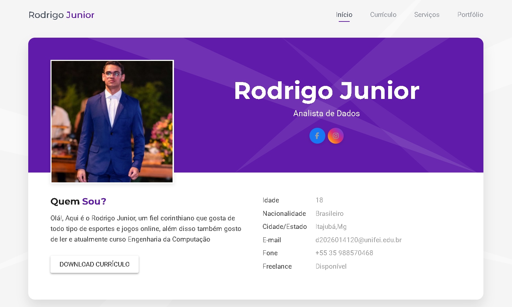

# Currículo online
> Projeto feito apartir de linguagens como HTML, CSS e Java Script com intuito de ser um Currículo online simples e prático.

Currículo traz breves informações sobre mim, formação acadêmica e experiências profissionais, assim como serviços já feitos e áreas de maior atuação.



### Por que usar este currículo?
```
1. Visibilidade Passiva
2. Espaço Ilimitado para Portfólio e Projetos
3. Atualização em Tempo Real
4. Facilidade de Compartilhamento e Acessibilidade
5. Métricas e Aprendizado
```

### Como foi Feito?
O projeto foi desenvolvido no VSCode, com utilização de ferramentas como o CSS, HTML, Java Script, ajuda de Git e GitHub para versionamento de código e arquivos pdf e png/jpeg para complementação visual.

# Meta
>Manter o currículo sempre atualizado e cada vez mais completo, com projetos, desenvolvimentos e aprendizados novos.